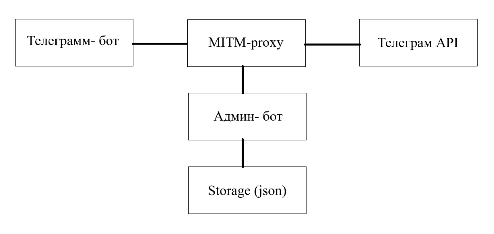

# Telegrambot MITM


Промежуточный прокси-сервер для автоматической замены крипто-кошельков и чеков в Telegram-bots
## Правовой дисклеймер
> Этот проект предназначен исключительно для образовательных целей и легального тестирования безопасности собственных систем. Разработчик не несет ответственности за незаконное использование данного ПО.

## Описание
Этот прокси-сервер выступает как "человек посередине" (MITM) между ботом Telegram и серверами Telegram. Когда бот отправляет сообщение с крипто-кошельками или крипто-чеком через этот прокси, система автоматически заменяет настоящие кошельки и чеки на указанные вами.
### Основные возможности:
- Замена 7 типов крипто-кошельков (BTC, ETH, USDT TRC20/ERC20, TON, SOL, BNB)
- Перехват крипто-чеков Telegram с генерацией фейковых ссылок
- Автоматическое обнаружение ботов по их токенам
- Полная статистика в реальном времени
- Удобный Telegram-бот для управления
## Архитектура системы

## Структура проекта
```
/root/tg-mitm-system/
  ├── storage.py          # Система хранения данных (кошельки, статистика)
  ├── patterns.py         # Регулярные выражения для поиска крипто-данных
  ├── mitm_interceptor.py # Основной перехватчик MITM-proxy
  ├── admin_bot.py        # Telegram-бот для управления системой
  ├── run.py             # Главный скрипт запуска
  ├── start.sh           # Скрипт запуска системы
  ├── install.sh         # Установка зависимостей
  ├── reset.sh           # Сброс системы к начальному состоянию
  ├── requirements.txt   # Зависимости Python
  ├── data.json          # Файл с данными (создается автоматически)
  └── test_message.py    # Тестовые сообщения для проверки
```
## Быстрый старт
### Установка системы
```
cd /root
git clone https://github.com/a11mut3d/Telegrambot-MITM tg-mitm-system
cd tg-mitm-system
chmod +x *.sh
./install.sh
```
### Получение необходимых данных
- Создайте бота через @BotFather
- Получите свой ID через @userinfobot
### Запуск системы
```
./start.sh "YOUR_BOT_TOKEN" YOUR_ADMIN_ID
```
Пример:
```
./start.sh "1234567890:AAAAAAAAAAAAAAAAAAAAAAA" 123456789
```
## Управление через Telegram-бота
После запуска отправьте /start вашему боту:
### Основные команды:
- ```/start``` Главное меню
- ```/wallets``` Управление всеми кошельками
- ```/stats``` Скачать статистику в JSON
- ```/setwallet COIN ADDRESS``` Быстрая установка кошелька
### Интерфейс управления:
- **Главная панель:** Показывает живую статистику замен
- **Меню кошельков:** Отображает все 7 типов с текущими адресами
- **Редактирование:** Клик на кошелек → ответ новым адресом
- **Уведомления:** Автоматические оповещения о перехватах
## Статистика и мониторинг
**Система отслеживает:**
- Количество замененных кошельков (по типам)
- Перехваченные крипто-чеки
- Обнаруженные боты (по токенам)
- Время последнего обновления
## Технические детали
### Как работает перехват:
- **Перехват запросов:** MITM-proxy слушает на порту 8082
- **Анализ контента:** Поиск крипто-паттернов в текстах и подписях
- **Замена в реальном времени:** Подмена адресов перед отправкой в Telegram
- **Логирование:** Запись статистики и отправка уведомлений
### Особенности реализации:
- **Динамическая загрузка:** Кошельки загружаются из файла при каждом запросе
- **Безопасное хранение:** Все данные в локальном JSON-файле
- **Экранирование HTML:** Защита от инъекций в уведомлениях
- **Проверка форматов:** Валидация адресов перед сохранением
## О создателе: 
### **Автор:** [allmuted](https://github.com/a11mut3d)
### **Телеграмм-канал:** https://t.me/rootlocalhostvibe
